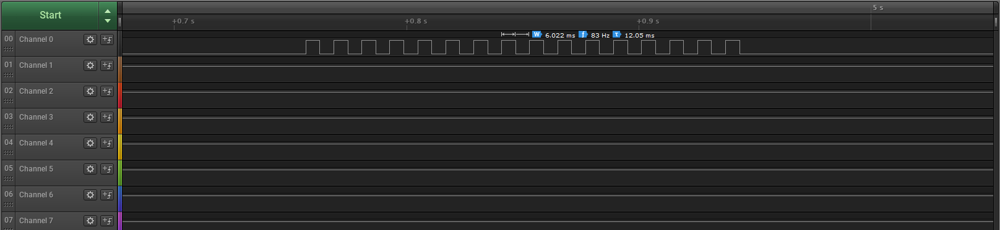

# Descrição do Projeto MSP430

Esse projeto consiste em tocar música em um arco elétrico, utilizando o microcontrolador MSP430G2452 da Texas Instrument e um flyback modelo  <s>-XXXXX-</s>.

# Início
Com base na tabela a seguir, criada pelo [professor Fernando Iazzetta do Departamento de Música da USP], utilizou-se o valor do período de cada nota musical para criar um programa (toca8oitavas.c) que varia o período da onda quadrada do PWM (com **duty-cicle** sempre em 50%) do microcontrolador para tocar a escala musical, começando da nota C1 (que é a nota DÓ de terceira oitava) até a B8 (que é a nota SI de décima oitava), ignorando todas as notas acidentas de meio tom (com um # em seu nome):

<table border="" cellspacing="2" cellpadding="1">
<tbody><tr>
	<td><b>Nota</b></td>
	<td><b>Frequência (Hz)</b></td>
	<td><b>Período (µs)</b></td>
	<td><b>Comprimento de Onda (m)</b></td>
</tr>
<tr>
	<td>C 1</td>
	<td>65.40638</td>
	<td>15289</td>
	<td>5.259425</td>
</tr>
<tr>
	<td>C# 1</td>
	<td>69.295647</td>
	<td>14431</td>
	<td>4.964236</td>
</tr>
<tr>
	<td>D 1</td>
	<td>73.416199</td>
	<td>13621</td>
	<td>4.685615</td>
</tr>
<tr>
	<td>D# 1</td>
	<td>77.781746</td>
	<td>12856</td>
	<td>4.422632</td>
</tr>
<tr>
	<td>E 1</td>
	<td>82.406876</td>
	<td>12135</td>
	<td>4.174408</td>
</tr>
<tr>
	<td>F 1</td>
	<td>87.307053</td>
	<td>11454</td>
	<td>3.940117</td>
</tr>
<tr>
	<td>F# 1</td>
	<td>92.498604</td>
	<td>10811</td>
	<td>3.718975</td>
</tr>
<tr>
	<td>G 1</td>
	<td>97.998848</td>
	<td>10204</td>
	<td>3.510245</td>
</tr>
<tr>
	<td>G# 1</td>
	<td>103.82618</td>
	<td>9631</td>
	<td>3.31323</td>
</tr>
<tr>
	<td>A 1</td>
	<td>110.0</td>
	<td>9091</td>
	<td>3.127273</td>
</tr>
<tr>
	<td>A# 1</td>
	<td>116.540947</td>
	<td>8581</td>
	<td>2.951752</td>
</tr>
<tr>
	<td>B 1</td>
	<td>123.470818</td>
	<td>8099</td>
	<td>2.786083</td>
</tr></tbody></table>

<table border="" cellspacing="2" cellpadding="1">
<tbody><tr>
	<td><b>Nota</b></td>
	<td><b>Frequência (Hz)</b></td>
	<td><b>Período (µs)</b></td>
	<td><b>Comprimento de Onda (m)</b></td>
</tr>
<tr>
	<td>C 2</td>
	<td>130.812775</td>
	<td>7645</td>
	<td>2.629713</td>
</tr>
<tr>
	<td>C# 2 </td>
	<td>138.591324</td>
	<td>7215</td>
	<td>2.482118</td>
</tr>
<tr>
	<td>D 2</td>
	<td>146.832367</td>
	<td>6810</td>
	<td>2.342808</td>
</tr>
<tr>
	<td>D# 2</td>
	<td>155.563492</td>
	<td>6428</td>
	<td>2.211316</td>
</tr>
<tr>
	<td>E 2</td>
	<td>164.813782</td>
	<td>6067</td>
	<td>2.087204</td>
</tr>
<tr>
	<td>F 2</td>
	<td>174.614105</td>
	<td>5727</td>
	<td>1.970058</td>
</tr>
<tr>
	<td>F# 2</td>
	<td>184.997208</td>
	<td>5405</td>
	<td>1.859488</td>
</tr>
<tr>
	<td>G 2</td>
	<td>195.997711</td>
	<td>5102</td>
	<td>1.755122</td>
</tr>
<tr>
	<td>G# 2</td>
	<td>207.652344</td>
	<td>4816</td>
	<td>1.656615</td>
</tr>
<tr>
	<td>A 2</td>
	<td>220.0</td>
	<td>4545</td>
	<td>1.563636</td>
</tr>
<tr>
	<td>A# 2</td>
	<td>233.081848</td>
	<td>4290</td>
	<td>1.475876</td>
</tr>
<tr>
	<td>B 2</td>
	<td>246.941635</td>
	<td>4050</td>
	<td>1.393042</td>
</tr></tbody></table>

<table border="" cellspacing="2" cellpadding="1">
<tbody><tr>
	<td><b>Nota</b></td>
	<td><b>Frequência (Hz)</b></td>
	<td><b>Período (µs)</b></td>
	<td><b>Comprimento de Onda (m)</b></td>
</tr>
<tr>
	<td>C 3</td>
	<td>261.625519</td>
	<td>3822</td>
	<td>1.314856</td>
</tr>
<tr>
	<td>C# 3</td>
	<td>277.182648</td>
	<td>3608</td>
	<td>1.241059</td>
</tr>
<tr>
	<td>D 3</td>
	<td>293.664734</td>
	<td>3405</td>
	<td>1.171404</td>
</tr>
<tr>
	<td>D# 3</td>
	<td>311.126984</td>
	<td>3214</td>
	<td>1.105658</td>
</tr>
<tr>
	<td>E 3</td>
	<td>329.627533</td>
	<td>3034</td>
	<td>1.043602</td>
</tr>
<tr>
	<td>F 3</td>
	<td>349.228241</td>
	<td>2863</td>
	<td>0.985029</td>
</tr>
<tr>
	<td>F# 3</td>
	<td>369.994385</td>
	<td>2703</td>
	<td>0.929744</td>
</tr>
<tr>
	<td>G 3</td>
	<td>391.995392</td>
	<td>2551</td>
	<td>0.877561</td>
</tr>
<tr>
	<td>G# 3</td>
	<td>415.304688</td>
	<td>2408</td>
	<td>0.828308</td>
</tr>
<tr>
	<td>A 3</td>
	<td>440.0</td>
	<td>2273</td>
	<td>0.781818</td>
</tr>
<tr>
	<td>A# 3</td>
	<td>466.163788</td>
	<td>2145</td>
	<td>0.737938</td>
</tr>
<tr>
	<td>B 3</td>
	<td>493.883301</td>
	<td>2025</td>
	<td>0.696521</td>
</tr></tbody></table>

<table border="" cellspacing="2" cellpadding="1">
<tbody><tr>
	<td><b>Nota</b></td>
	<td><b>Frequência (Hz)</b></td>
	<td><b>Período (µs)</b></td>
	<td><b>Comprimento de Onda (m)</b></td>
</tr>
<tr>
	<td>C 4</td>
	<td>523.251099</td>
	<td>1911</td>
	<td>0.657428</td>
</tr>
<tr>
	<td>C# 4</td>
	<td>554.365234</td>
	<td>1804</td>
	<td>0.620529</td>
</tr>
<tr>
	<td>D 4</td>
	<td>587.329529</td>
	<td>1703</td>
	<td>0.585702</td>
</tr>
<tr>
	<td>D# 4</td>
	<td>622.253906</td>
	<td>1607</td>
	<td>0.552829</td>
</tr>
<tr>
	<td>E  4</td>
	<td>659.255127</td>
	<td>1517</td>
	<td>0.521801</td>
</tr>
<tr>
	<td>F 4</td>
	<td>698.456482</td>
	<td>1432</td>
	<td>0.492515</td>
</tr>
<tr>
	<td>F# 4</td>
	<td>739.988831</td>
	<td>1351</td>
	<td>0.464872</td>
</tr>
<tr>
	<td>G 4</td>
	<td>783.990845</td>
	<td>1276</td>
	<td>0.438781</td>
</tr>
<tr>
	<td>G# 4</td>
	<td>830.609375</td>
	<td>1204</td>
	<td>0.414154</td>
</tr>
<tr>
	<td>A 4</td>
	<td>880.0</td>
	<td>1136</td>
	<td>0.390909</td>
</tr>
<tr>
	<td>A# 4</td>
	<td>932.327576</td>
	<td>1073</td>
	<td>0.368969</td>
</tr>
<tr>
	<td>B 4</td>
	<td>987.766602</td>
	<td>1012</td>
	<td>0.34826</td>
</tr></tbody></table>

<table border="" cellspacing="2" cellpadding="1">
<tbody><tr>
	<td><b>Nota</b></td>
	<td><b>Frequência (Hz)</b></td>
	<td><b>Período (µs)</b></td>
	<td><b>Comprimento de Onda (m)</b></td>
</tr>
<tr>
	<td>C 5</td>
	<td>1046.502075</td>
	<td>956</td>
	<td>0.328714</td>
</tr>
<tr>
	<td>C# 5</td>
	<td>1108.730591</td>
	<td>902</td>
	<td>0.310265</td>
</tr>
<tr>
	<td>D 5</td>
	<td>1174.659058</td>
	<td>851</td>
	<td>0.292851</td>
</tr>
<tr>
	<td>D# 5</td>
	<td>1244.507935</td>
	<td>804</td>
	<td>0.276414</td>
</tr>
<tr>
	<td>E 5</td>
	<td>1318.510254</td>
	<td>758</td>
	<td>0.2609</td>
</tr>
<tr>
	<td>F 5</td>
	<td>1396.912964</td>
	<td>716</td>
	<td>0.246257</td>
</tr>
<tr>
	<td>F# 5</td>
	<td>1479.977539</td>
	<td>676</td>
	<td>0.232436</td>
</tr>
<tr>
	<td>G 5</td>
	<td>1567.981812</td>
	<td>638</td>
	<td>0.21939</td>
</tr>
<tr>
	<td>G# 5</td>
	<td>1661.21875</td>
	<td>602</td>
	<td>0.207077</td>
</tr>
<tr>
	<td>A 5</td>
	<td>1760.0</td>
	<td>568</td>
	<td>0.195455</td>
</tr>
<tr>
	<td>A# 5</td>
	<td>1864.654785</td>
	<td>536</td>
	<td>0.184485</td>
</tr>
<tr>
	<td>B 5</td>
	<td>1975.533325</td>
	<td>506</td>
	<td>0.17413</td>
</tr></tbody></table>

<table border="" cellspacing="2" cellpadding="1">
<tbody><tr>
	<td><b>Nota</b></td>
	<td><b>Frequência (Hz)</b></td>
	<td><b>Período (µs)</b></td>
	<td><b>Comprimento de Onda (m)</b></td>
</tr>
<tr>
	<td>C 6</td>
	<td>2093.004395</td>
	<td>478</td>
	<td>0.164357</td>
</tr>
<tr>
	<td>C# 6</td>
	<td>2217.460938</td>
	<td>451</td>
	<td>0.155132</td>
</tr>
<tr>
	<td>D  6</td>
	<td>2349.318115</td>
	<td>426</td>
	<td>0.146425</td>
</tr>
<tr>
	<td>D# 6</td>
	<td>2489.015625</td>
	<td>402</td>
	<td>0.138207</td>
</tr>
<tr>
	<td>E 6</td>
	<td>2637.020264</td>
	<td>379</td>
	<td>0.13045</td>
</tr>
<tr>
	<td>F 6</td>
	<td>2793.825928</td>
	<td>358</td>
	<td>0.123129</td>
</tr>
<tr>
	<td>F# 6</td>
	<td>2959.955078</td>
	<td>338</td>
	<td>0.116218</td>
</tr>
<tr>
	<td>G 6</td>
	<td>3135.963135</td>
	<td>319</td>
	<td>0.109695</td>
</tr>
<tr>
	<td>G# 6</td>
	<td>3322.4375</td>
	<td>301</td>
	<td>0.103538</td>
</tr>
<tr>
	<td>A 6</td>
	<td>3520.0</td>
	<td>284</td>
	<td>0.097727</td>
</tr>
<tr>
	<td>A# 6</td>
	<td>3729.30957</td>
	<td>268</td>
	<td>0.092242</td>
</tr>
<tr>
	<td>B 6</td>
	<td>3951.066895</td>
	<td>253</td>
	<td>0.087065</td>
</tr></tbody></table>

<table border="" cellspacing="2" cellpadding="1">
<tbody><tr>
	<td><b>Nota</b></td>
	<td><b>Frequência (Hz)</b></td>
	<td><b>Período (µs)</b></td>
	<td><b>Comprimento de Onda (m)</b></td>
</tr>
<tr>
	<td>C 7</td>
	<td>4186.008301</td>
	<td>239</td>
	<td>0.082179</td>
</tr>
<tr>
	<td>C# 7</td>
	<td>4434.921875</td>
	<td>225</td>
	<td>0.077566</td>
</tr>
<tr>
	<td>D 7</td>
	<td>4698.636719</td>
	<td>213</td>
	<td>0.073213</td>
</tr>
<tr>
	<td>D# 7</td>
	<td>4978.03125</td>
	<td>201</td>
	<td>0.069104</td>
</tr>
<tr>
	<td>E 7</td>
	<td>5274.040039</td>
	<td>190</td>
	<td>0.065225</td>
</tr>
<tr>
	<td>F 7</td>
	<td>5587.651367</td>
	<td>179</td>
	<td>0.061564</td>
</tr>
<tr>
	<td>F# 7</td>
	<td>5919.910645</td>
	<td>169</td>
	<td>0.058109</td>
</tr>
<tr>
	<td>G 7</td>
	<td>6271.92627</td>
	<td>159</td>
	<td>0.054848</td>
</tr>
<tr>
	<td>G# 7</td>
	<td>6644.875</td>
	<td>150</td>
	<td>0.051769</td>
</tr>
<tr>
	<td>A 7</td>
	<td>7040.0</td>
	<td>142</td>
	<td>0.048864</td>
</tr>
<tr>
	<td>A# 7</td>
	<td>7458.621094</td>
	<td>134</td>
	<td>0.046121</td>
</tr>
<tr>
	<td>B 7</td>
	<td>7902.131836</td>
	<td>127</td>
	<td>0.043533</td>
</tr></tbody></table>

<table border="" cellspacing="2" cellpadding="1">
<tbody><tr>
	<td><b>Nota</b></td>
	<td><b>Frequência (Hz)</b></td>
	<td><b>Período (µs)</b></td>
	<td><b>Comprimento de Onda (m)</b></td>
</tr>
<tr>
	<td>C 8</td>
	<td>8372.016602</td>
	<td>119</td>
	<td>0.041089</td>
</tr>
<tr>
	<td>C# 8</td>
	<td>8869.844727</td>
	<td>113</td>
	<td>0.038783</td>
</tr>
<tr>
	<td>D 8</td>
	<td>9397.270508</td>
	<td>106</td>
	<td>0.036606</td>
</tr>
<tr>
	<td>D# 8 </td>
	<td>9956.063477</td>
	<td>100</td>
	<td>0.034552</td>
</tr>
<tr>
	<td>E 8</td>
	<td>10548.083008</td>
	<td>95</td>
	<td>0.032613</td>
</tr>
<tr>
	<td>F 8</td>
	<td>11175.301758</td>
	<td>89</td>
	<td>0.030782</td>
</tr>
<tr>
	<td>F# 8</td>
	<td>11839.820312</td>
	<td>84</td>
	<td>0.029054</td>
</tr>
<tr>
	<td>G 8</td>
	<td>12543.855469</td>
	<td>80</td>
	<td>0.027424</td>
</tr>
<tr>
	<td>G# 8</td>
	<td>13289.748047</td>
	<td>75</td>
	<td>0.025885</td>
</tr>
<tr>
	<td>A 8</td>
	<td>14080.0</td>
	<td>71</td>
	<td>0.024432</td>
</tr>
<tr>
	<td>A# 8</td>
	<td>14917.242188</td>
	<td>67</td>
	<td>0.023061</td>
</tr>
<tr>
	<td>B 8</td>
	<td>15804.263672</td>
	<td>63</td>
	<td>0.021766</td>
</tr></tbody></table>

 

 
<h5>

## Resultados do Início

Utilizando-se um analisador lógico da fabricante [Salae] (dispositivo semelhante a um osciloscópio que exibe a forma de onda em um de seus oito canais), obteve-se os resultados das ondas quadradas geradas no pino de saída do PWM da MSP430, e o resultados estão demonstrados nas imagens a seguir.

 Onda gerada a partir da nota musical C1 (dó)

 Onda gerada a partir da nota musical D1 (ré)

 Onda gerada a partir da nota musical E1 (mi)

 Onda gerada a partir da nota musical F1 (fá)

 Onda gerada a partir da nota musical G1 (sol)

 Onda gerada a partir da nota musical A1 (lá)

 Onda gerada a partir da nota musical B1 (si)

[//]: # (Links utilizados no texto)
   [professor Fernando Iazzetta do Departamento de Música da USP]: <http://www2.eca.usp.br/prof/iazzetta/tutor/acustica/introducao/tabela1.html>
   [Salae]: <https://www.saleae.com/downloads/>
